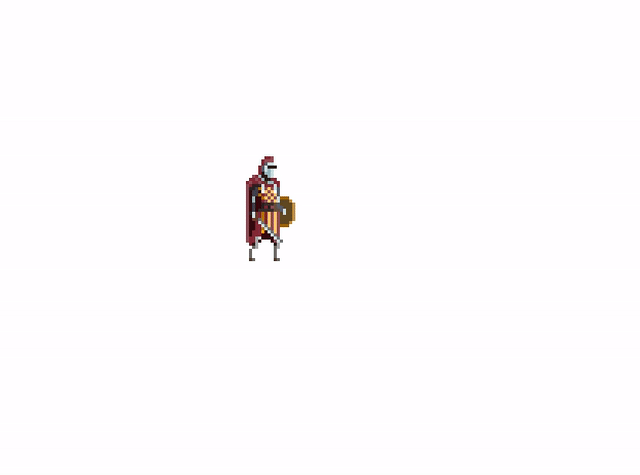

# sdlgl-knight-game
A simple knight fighting game using my SDLGL game library.



Currently, the game only has a player character, but I've worked to give it smooth animations between attacking, blocking, and moving.

## Building

Building this project requires [SDLGL](https://github.com/graysonpike/sdlgl) to be installed. See the SDLGL README for installation instructions.


After installing SDLGL, you can build this project by running
```
make
```

## Running

You can run this project with
```
./main.out
```

## Art Credits

The art for the knight character was made by [Warren Clark](https://lionheart963.itch.io/) and can be found on [this itch.io page](https://lionheart963.itch.io/knight-sprite).
